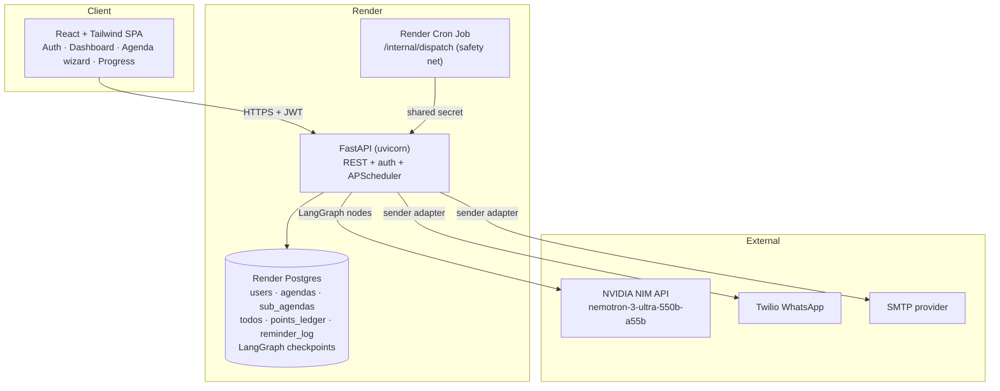

# Agent DA — Architecture Plan

**Status:** Backend implemented in `apps/api` (36 tests passing). The React frontend is deliberately
deferred. See [`running.md`](./running.md) to start it.

An agent that helps a user reach a long-term agenda by breaking it into daily sub-agendas,
turning each day's sub-agenda into a concrete to-do list, reminding the user on their chosen
channel, and rewarding completion with points and streaks.

## 1. Confirmed decisions

| Area | Decision |
| --- | --- |
| Delivery | Backend + agent built; frontend deferred |
| Agent orchestration | LangGraph (Python) — `StateGraph` with a Postgres checkpointer |
| LLM | `nvidia/nemotron-3-ultra-550b-a55b` via NVIDIA NIM, structured output; a deterministic offline planner runs when no API key is configured |
| Backend | FastAPI (ASGI) exposing the LangGraph agent + REST API |
| Frontend | React + Vite + Tailwind CSS (not built yet) |
| Database | Render Postgres (async SQLAlchemy 2.x + Alembic); SQLite for local dev and tests |
| Auth | Email + password (bcrypt), JWT access tokens + rotating refresh tokens |
| Email verification | **Optional** — never blocks reminders |
| Scheduling | APScheduler (AsyncIOScheduler) inside the FastAPI process + Render Cron safety net |
| WhatsApp | Twilio WhatsApp primary, Meta Cloud API fallback, console channel when no credentials exist |
| Email | SMTP via env config (Resend / SendGrid / Mailgun / Gmail app password) |
| Gamification | Points + daily streaks + bonus rules, with a **5-point missed-day deduction** |
| Timeframe | Capped at **90 days** (`MAX_TIMEFRAME_DAYS`) |
| Overdue tasks | Left marked missed — **not carried forward** |
| Active agendas | **Multiple per user** allowed |
| Daily motivation | One LLM call per user per day |

## 2. Goals and non-goals

**Goals**

- Turn a vague long-term intention into a *sequenced*, date-anchored plan that is guaranteed to
  finish on the last day of the user's timeframe.
- Keep the human in the loop: the plan is generated, shown, edited, and only then activated.
- Deliver one reminder per day, exactly once, at the user's chosen local time.
- Make progress measurable: per-task points, day bonuses, streaks, agenda-completion bonus.

**Non-goals (v1)**

- Native mobile app (responsive web only).
- Multi-user collaboration / shared agendas.
- Push notifications, calendar sync, voice.
- Payment tiers.

## 3. System diagram



## 4. Repository layout

```
agent_da/
├─ apps/
│  └─ api/                          # FastAPI + LangGraph  (built)
│     ├─ app/
│     │  ├─ main.py                 # app factory, lifespan, scheduler start/stop
│     │  ├─ cli.py                  # dispatch | materialize | day-close | demo
│     │  ├─ core/                   # config, security, deps, errors, logging, ratelimit, timezones
│     │  ├─ db/                     # base mixins, async engine/session
│     │  ├─ models/                 # user, agenda, sub_agenda, points, reminder (+ enums)
│     │  ├─ schemas/                # Pydantic request/response models
│     │  ├─ api/routers/            # auth, users, agendas, todos, dashboard, internal, health
│     │  ├─ services/               # user, agenda, plan, todo, points, streak, materializer,
│     │  │                          # reminder, dashboard
│     │  ├─ agents/                 # graph, nodes, runner, checkpointer, llm, schemas,
│     │  │  │                       # fake (offline planner), state
│     │  │  └─ prompts/             # intake_v1, plan_v1, critique_v1, todos_v1, motivation_v1
│     │  ├─ integrations/channels/  # base, email (SMTP), whatsapp (Twilio/Meta), console, registry
│     │  └─ scheduler/              # scheduler.py (APScheduler), jobs.py
│     ├─ alembic/                   # env.py + versions/1b990407c9a2_initial_schema.py
│     ├─ tests/                     # conftest, test_auth, test_agent_graph,
│     │                             # test_agenda_flow, test_missed_days
│     ├─ pyproject.toml
│     └─ requirements.txt
├─ apps/web/                        # React + Vite + Tailwind  (NOT BUILT YET)
├─ docs/                            # this file, data-model, langgraph-agent, api-contract, running
├─ render.yaml                      # Web Service + Cron Jobs + Postgres blueprint
├─ .env.example
└─ README.md
```

## 5. Core runtime flows

### 5.1 Onboarding and agenda creation

1. `POST /auth/signup` → user row, hashed password, JWT pair.
2. User sets timezone (default from browser, `Intl.DateTimeFormat().resolvedOptions().timeZone`).
3. Agenda wizard collects: title, description, `timeframe_days`, `start_date` (default today local),
   `reminder_time` (local `HH:MM`), `reminder_channel` (`email` | `whatsapp`), phone number if WhatsApp.
4. `POST /agendas` stores the agenda as `draft` and returns the id.

### 5.2 Draft generation (LangGraph, human-in-the-loop)

1. `POST /agendas/{id}/generate` creates a draft, moves the agenda to `generating`, and returns
   `202 { draft_id }`. The graph runs as a background task (`AGENT_AUTOSTART=true`); set it to
   `false` to queue drafts for an external worker.
2. The graph may `interrupt()` to ask clarifying questions; the client answers with
   `POST /agendas/{id}/draft/answers` and the run resumes from the checkpoint.
3. The graph plans `timeframe_days` sub-agendas on a deterministic dated skeleton, critiques and
   repairs them, expands the first few days into to-dos, then `interrupt()`s for human review.
4. The runner writes the plan to `sub_agendas` / `todos` and sets the draft to `needs_review`.
   The client polls `GET /agendas/{id}/draft` (no SSE endpoint yet).
5. The user edits days in place (`PATCH /agendas/{id}/days/{day_index}`), changes to-dos, or
   regenerates (`POST /agendas/{id}/regenerate`), then `POST /agendas/{id}/approve`.
6. Approval resumes the graph to `finalize`, flips the agenda to `active`, creates one reminder row
   per remaining day, and pre-expands the preview window. Nothing is registered per-user in the
   scheduler — the dispatcher picks rows up from the table.

### 5.3 Daily materialization + delivery

- **Materialization job** (every 30 min): for each active agenda, expand to-dos for any day inside
  the `PREEXPAND_DAYS` horizon that has none yet. The first 3 days are expanded at approval time so
  the user reviews real to-dos immediately.
- **Dispatcher** (every 60 s, plus a Render Cron safety net at `*/5 * * * *`): select reminders where
  `status = pending AND scheduled_for <= now() AND attempted < max`, claim them with
  `SELECT ... FOR UPDATE SKIP LOCKED`, render the message, send through the channel adapter, and
  record `sent_at` / provider id / error. Failures retry, then land as `failed`.
- **Day close** (every 30 min): for each agenda, close every day that has fully elapsed in the
  user's timezone — marking it `done` or `missed`, applying the −5 penalty once, recomputing
  streaks, and scheduling weekly rollups. Days before `start_date` are never closed early.

### 5.4 Completion

- `POST /todos/{id}/complete` → mark done under a row lock, append a `points_ledger` row keyed by
  `todo:{id}:completed:{seq}`, award the day bonus if the day just became complete, recompute the
  streak, then award the agenda and perfect-run bonuses if this was the final day.
- `POST /todos/{id}/uncomplete` → append compensating negative rows for the task points, the day
  bonus and (if needed) the agenda bonuses. The ledger is never mutated or deleted.
- Repeating either call is a no-op: the response reports `already_complete` / `already_open`.

## 6. Points, streaks, and bonus rules

Config lives in `app/core/config.py` (env-overridable) so values are tunable without a migration.

| Rule | Default | Trigger |
| --- | --- | --- |
| Task completed | +10 | Each to-do marked done |
| Day complete | +25 | All to-dos for that date are done |
| Streak milestone | +100 | Every 7 consecutive complete days |
| Agenda completed | +250 | The final day's sub-agenda becomes fully complete |
| Perfect run | +500 | Agenda completed with **every** day fully complete |
| Missed day | **−5** | Day closes with incomplete to-dos |

**Streak definition.** A day counts toward the streak when it had at least one to-do and *all* of
them were complete. Days with nothing scheduled are skipped rather than breaking the streak.

**Missed days (product decision).** A day that closes incomplete is worth −5 points and resets
`current_streak`. Already-earned task points are never removed. The penalty only fires once per day
because it carries a deterministic idempotency key. Set `ALLOW_POINT_DEDUCTIONS=false` to make
missed days points-neutral instead.

**No rollover (product decision).** Overdue to-dos stay attached to their original day and are
marked missed; they are never copied into today's list. `ROLLOVER_OVERDUE_TASKS=false`.

**Ledger integrity.** The ledger is append-only and every row carries a deterministic
`idempotency_key` backed by a unique constraint, so double-taps, replayed scheduler ticks and
resumed graph runs cannot double-award. Un-completing appends compensating negative rows
(task points, day bonus, and agenda/perfect bonuses if the agenda had already completed).
`users.points_balance` is a cached sum, refreshable with `points_service.reconcile_user`.

**Weekly rollup.** Each Sunday (user-local) the agent summarises points earned, completion rate and
the streak, and sends it through the same channel.

## 7. Reminder message shape

Rendered from a template with a light LLM motivational line (cached per day to control cost):

```
Subject/Body title: Day 4 of 30 — "Ship the onboarding flow"
Good morning Ada — you're 12% through this agenda and on a 4-day streak. 🔥
Today's focus: Ship the onboarding flow
  [ ] Draft the 3 onboarding screens
  [ ] Wire email verification
  [ ] Record a 60s walkthrough
Reply/click "Open dashboard" to tick items off.
```

WhatsApp constraints: Twilio only allows free-form messages within a 24-hour user-initiated session,
so the daily reminder must be an **approved template** (or the user must reply once to open a
window). The adapter will support `content_sid` templates with variables, falling back to
free-form for email.

## 8. Deployment on Render

- **Web Service**: `uvicorn app.main:app` from `apps/api`, health check `/healthz`. Scheduler runs
  inside the app; `SCHEDULER_ENABLED=true` on exactly one instance.
- **Postgres**: managed instance, `DATABASE_URL` injected.
- **Cron Job (safety net)**: `*/5 * * * *` → `python -m app.cli dispatch`, in case the in-process
  scheduler stalls during a deploy. A second hourly cron runs `python -m app.cli day-close` so
  missed-day penalties and streaks are applied even mid-deploy.
- **Static site / Node service**: the Vite build for `apps/web` (`VITE_API_URL` at build time).
- Migrations run on release (`alembic upgrade head`) before the new instance goes live.

Environment variables: see [`.env.example`](../.env.example) for the full annotated list. Every
value has a working default, so the app boots and degrades gracefully with an empty file.

| Var | Purpose |
| --- | --- |
| `DATABASE_URL` | Postgres async DSN (Render injects it) |
| `JWT_SECRET`, `JWT_ALGORITHM`, `ACCESS_TOKEN_TTL_MINUTES`, `REFRESH_TOKEN_TTL_DAYS` | Auth |
| `NVIDIA_API_KEY`, `NVIDIA_BASE_URL`, `LLM_MODEL`, `LLM_TEMPERATURE`, `LLM_MAX_TOKENS` | NIM access |
| `CHECKPOINTER_BACKEND` | `memory` locally, `postgres` in production |
| `TWILIO_*`, `META_WHATSAPP_*`, `WHATSAPP_PROVIDER` | WhatsApp |
| `SMTP_HOST`, `SMTP_PORT`, `SMTP_USER`, `SMTP_PASSWORD`, `SMTP_FROM`, `SMTP_STARTTLS`, `SMTP_SSL` | Email |
| `INTERNAL_TOKEN` | Cron → `/internal/*` auth |
| `SCHEDULER_ENABLED`, `DISPATCH_INTERVAL_SECONDS`, `MATERIALIZE_INTERVAL_MINUTES` | Scheduler control |
| `MISSED_DAY_DEDUCTION`, `ALLOW_POINT_DEDUCTIONS`, `*_BONUS`, `TASK_COMPLETED_POINTS` | Gamification |
| `MAX_TIMEFRAME_DAYS`, `PREEXPAND_DAYS`, `PLAN_CHUNK_*`, `TODOS_PER_DAY_*` | Planning shape |

## 9. Security

- bcrypt password hashing with SHA-256 pre-hashing for passwords over 72 bytes.
- Email verification is **optional** (product decision); when requested it uses a signed,
  single-purpose JWT. Reminders are never gated on it.
- Short-lived access JWT + opaque refresh token, stored only as a SHA-256 hash. Rotation detects
  reuse and revokes every session for that user.
- Password reset tokens are single-purpose JWTs; `forgot-password` always returns `202` so it
  cannot enumerate accounts.
- Phone numbers are stored for Twilio only and are never returned in list payloads.
- Rate limits on `/auth/*` (per IP) and `/agendas/{id}/generate` (per user, the expensive path).
- Ownership is checked on every agenda, day and to-do lookup; cross-account access returns `403`.
- Internal endpoints require the `X-Internal-Token` header.
- Model output is treated as untrusted: it is normalised onto a dated skeleton and every field is
  length-capped before it reaches the database.

- PII: reminder bodies contain agenda text; retention policy `REMINDER_RETENTION_DAYS=90`.
- All internal endpoints require `X-Internal-Token`.

## 10. Risks and mitigations

| Risk | Mitigation |
| --- | --- |
| 550B model latency or malformed JSON on a 60-day plan | Structured output with a JSON-repair retry, deterministic re-normalisation onto a fixed dated skeleton, chunked planning in 7-day windows above 21 days, background job + polling UI |
| Model returns the wrong number of days | The skeleton is built deterministically; `_normalise_plan` forces the count, dates and ordering, and substitutes a fallback day for any omission |
| Generation cost for long timeframes | Lazy per-day to-do expansion (only the first 3 days up front), motivation rendered once and cached on the reminder row, regeneration limited to a single day unless "all" is requested |
| WhatsApp template approval blocks delivery | Email is the default channel; `WHATSAPP_PROVIDER=auto` degrades Twilio → Meta → console, and a failed WhatsApp send falls back to email |
| Scheduler double-send during deploy | Unique `dedupe_key` per (agenda, day, kind, date), `SELECT ... FOR UPDATE SKIP LOCKED` claiming, and a `sent_at` guard |
| DST / timezone drift | `reminder_time` stored as local wall time plus an IANA `timezone`; the UTC fire time is recomputed per day rather than using a fixed offset |
| User edits drift the plan off-track | User-edited days are flagged and never overwritten by regeneration; dates are recomputed from `start_date` and the finale is re-validated |
| Un-completing a to-do inflates points | Compensating negative ledger rows for the task, the day bonus and the agenda bonus, each keyed for idempotency |
| A single bad reminder breaking a batch | Dispatch isolates failures per reminder; a failed send is retried up to `DISPATCH_MAX_ATTEMPTS` then marked failed |

## 11. Delivery milestones

1. **M1 — Skeleton** ✅ monorepo, FastAPI + Postgres + Alembic, auth, Render blueprint
2. **M2 — Plan generation** ✅ LangGraph intake → clarify → plan → critique → repair → expand → review, draft API
3. **M3 — Daily execution** ✅ materialisation, to-do CRUD, completion, points ledger, dashboard
4. **M4 — Delivery** ✅ channel adapters (SMTP / Twilio / Meta / console), dispatcher, APScheduler + cron safety net
5. **M5 — Gamification** ✅ streaks, missed-day penalties, bonuses, weekly rollup, progress endpoint
6. **M6 — Hardening** ✅ 36 tests, rate limits, structured logging, health/readiness, Alembic migration
7. **M7 — Frontend** ⏳ React + Vite + Tailwind: auth, dashboard, agenda wizard, progress charts

## 12. Resolved product questions

All seven were answered before M1 started; the answer is now enforced in code and covered by tests.

| Question | Answer | Where it lives |
| --- | --- | --- |
| Missed days | Deduct **5 points** | `MISSED_DAY_DEDUCTION`, `streak_service.close_day` |
| Timeframe bounds | Cap at **90 days** | `MAX_TIMEFRAME_DAYS`, `agenda_service.create_agenda`, agent `intake_validate` |
| Overdue tasks | **Leave marked missed**, no rollover | `ROLLOVER_OVERDUE_TASKS=false`, `test_overdue_tasks_are_not_carried_forward` |
| Email verification | **Optional** | `EMAIL_VERIFICATION_REQUIRED=false`; never gates reminders |
| Active agendas | **Multiple allowed** | `MAX_ACTIVE_AGENDAS_PER_USER=0` (unlimited); dashboard returns a list |
| Daily motivation | **One LLM call per user per day** | `nodes.motivation_line`, result cached on `reminders.body_preview` |
| WhatsApp sender | Twilio preferred, **Meta as fallback**, console when neither is configured | `channels/registry.py`, `WHATSAPP_PROVIDER=auto` |

### Still open (frontend-facing decisions)

1. Should editing a day's sub-agenda title offer to regenerate that day's to-dos, or leave them?
2. Do you want an onboarding "first agenda" wizard, or a single create form?
3. Should the dashboard show one agenda at a time with tabs, or a stacked list?

